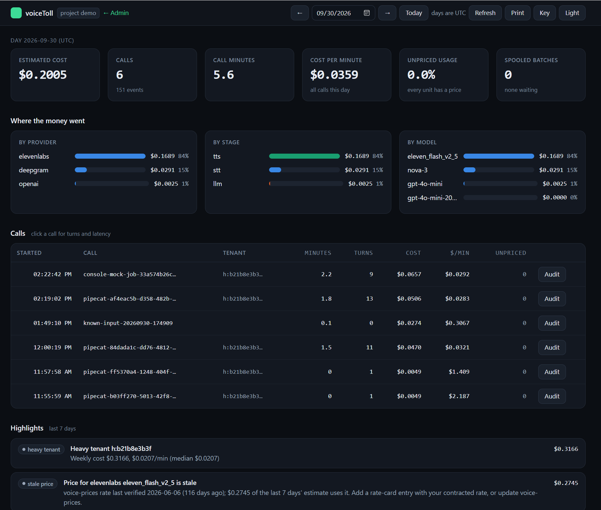
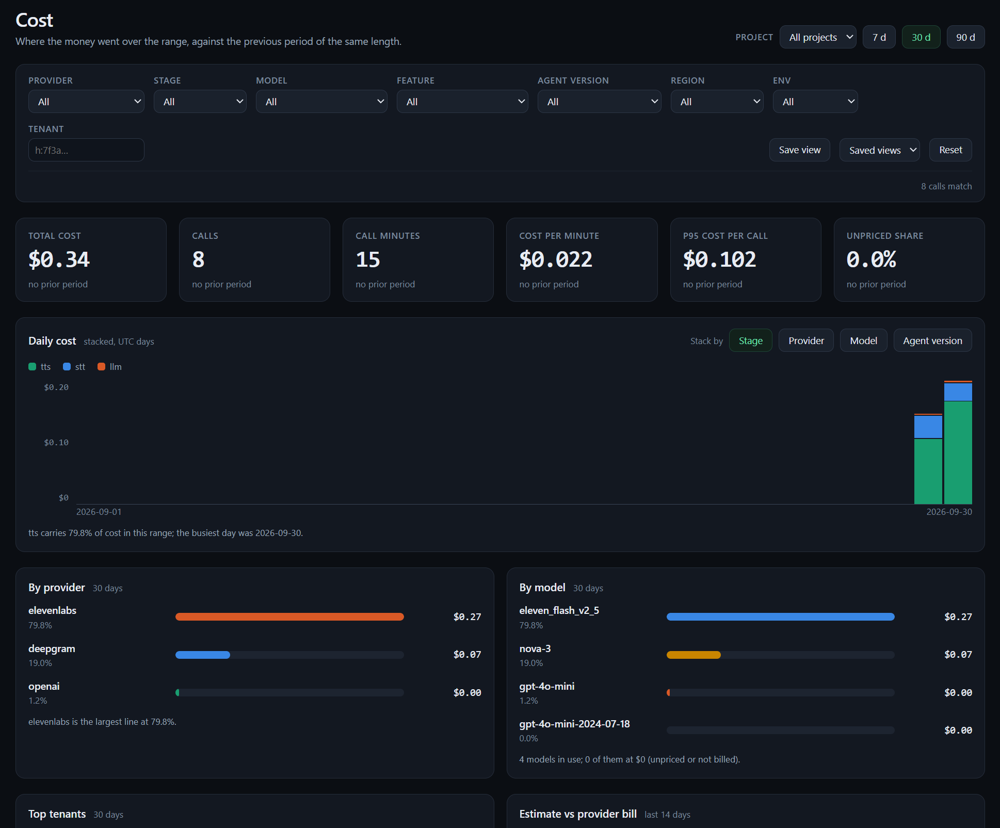

# voiceToll

Per-call, per-customer cost and latency for voice AI apps in production, without adding latency to the app.

Voice agents run several meters at once (speech-to-text, an LLM, text-to-speech, telephony), each billed in a different unit. Frameworks such as LiveKit Agents and Pipecat already report usage and timings, but not dollars. voiceToll turns those events into dollars using current, dated prices ([voice-prices](https://github.com/mahimailabs/voice-prices) plus your own rate cards), attributes them to tenants, users and features, and stores raw units so history can be re-priced.





**Status:** see [13 Project status](docs/13_STATUS.md).

## Repository layout

```
packages/
  voicetoll/             client: adapters for LiveKit, Pipecat and record(); stdlib only
  voicetoll-collector/   collector: ingest API, pricing, storage, spool, summaries
config/                  rate card example
examples/                demo_fake_call.py (no agent needed), LiveKit and Pipecat samples,
                         test_agent/ (G3 week: real LiveKit agent + daily bill check)
tests/                   unittest suite (runs under pytest too)
docs/                    architecture, viability, concepts, landscape, examples
```

## Step 1: see the cost of every call (no provider keys needed)

Windows PowerShell; macOS/Linux work the same.

```powershell
uv sync                                   # creates .venv, installs both packages + dev tools
Copy-Item .env.example .env               # then edit if needed
Copy-Item config\rate_cards.example.yaml config\rate_cards.yaml

# terminal 1: collector on SQLite (no Docker needed); --env-file loads .env (the collector does not read it itself)
uv run --env-file .env voicetoll-collector serve

# terminal 2: send a simulated 3-turn call and print its cost
uv run python examples/demo_fake_call.py

# then open the built-in report and enter your ingest key (dev-key in .env.example)
Start-Process http://localhost:4319/report

# admin UI (prices in use, reports for every project, cost, collector health): set VOICETOLL_ADMIN_KEY first
Start-Process http://localhost:4319/admin

# price something directly
uv run voicetoll-collector price --provider elevenlabs --model eleven_flash_v2_5 --unit characters=188

# how fresh are the rates behind recent costs (also applies any rate-card change now)
uv run --env-file .env voicetoll-collector prices

# tests
uv run pytest
```

With Docker Desktop, `docker compose up -d` runs Postgres and the collector on port 4319 instead.

Every provider and model voiceToll prices out of the box is listed in the admin UI under Prices → **All available**. A rate card is only needed when you pay a different rate than the list price.

## Step 2 (optional): check against your provider bills

voiceToll can compare its figures with each provider's own usage data, daily and per call. This needs read access to each provider's usage. `doctor` tests the keys you already have, finds the provider-side project, names any missing permission with a link, and saves the result:

```powershell
uv run --env-file .env voicetoll-collector doctor           # check and explain
uv run --env-file .env voicetoll-collector doctor --write   # save working settings to config/reconcile.yaml
```

Deepgram and ElevenLabs can use the agent's own key (`DEEPGRAM_API_KEY`, `ELEVEN_API_KEY`); a separate read-only key (`VOICETOLL_RECON_<PROVIDER>_KEY`) is recommended and used when set. OpenAI needs an organization admin key. See [11 Verification](docs/11_VERIFICATION.md) for the per-call audit and [12 Getting started](docs/12_ONBOARDING.md) for a step-by-step guide.

If `voice-prices` does not resolve from PyPI, install it from GitHub:
`uv add "voice-prices @ git+https://github.com/mahimailabs/voice-prices#subdirectory=packages/python"` in `packages/voicetoll-collector`.

## Collector API

| Endpoint | Purpose |
| --- | --- |
| `POST /v1/events` | Ingest a batch (gzip or JSON, header `X-Voicetoll-Key`) |
| `POST /v1/otlp/v1/traces` | OTLP/HTTP traces (JSON or protobuf) mapped to capture events |
| `GET /admin` | Admin UI (needs `VOICETOLL_ADMIN_KEY`, header `X-Voicetoll-Admin-Key`): prices in use with stale tags, reports for any project, cost dashboard, collector health. Off in a shared deploy until the key is set |
| `GET /v1/admin/{projects,prices,days,cost,health}` | Read-only admin views across projects, with filters; see [08 Admin UI](docs/08_ADMIN_UI.md) |
| `GET /v1/admin/catalog` | Every price available (voice-prices catalog plus rate cards), filtered and paged, marked in use or overridden |
| `GET /v1/audit/{call}` | One call against each provider's own usage log (makes provider API calls) |
| `GET /report` | Built-in report in the browser: day summary, calls, one call's turns and latency, highlights, reconciliation (`/` redirects here) |
| `GET /v1/calls?day=YYYY-MM-DD` | Calls on a day with minutes, turns, cost, unpriced lines (newest first) |
| `GET /v1/sessions/{id}` | Cost by component and turn, latency percentiles, for one call |
| `GET /v1/tenants/{tenant}/daily?days=7` | Calls, minutes, cost and cost per minute per day |
| `GET /v1/tenants?day=YYYY-MM-DD` | Tenants ranked by cost |
| `GET /v1/breakdown/{feature\|component\|provider\|model\|region\|agent_version\|user_id}?day=` | Cost by dimension |
| `GET /v1/highlights?days=7` | Ranked rule-based findings |
| `GET /v1/coverage?day=` | Events, unpriced share, spool/counters |
| `GET /v1/recon?days=14` | Reconciliation runs: estimate vs provider figure, drift, status |
| `GET /v1/prices` | Price freshness per provider/model, price versions, last automatic reprice |
| `GET /healthz`, `GET /metrics` | Health, Prometheus counters |

## Documentation

| Doc | What it covers |
| --- | --- |
| [01 Architecture](docs/01_ARCHITECTURE.md) | Components, adapters, pipeline, latency, highlights, data model, flows, privacy, roadmap |
| [02 Viability review](docs/02_VIABILITY_REVIEW.md) | Need, current practice, risks, recommendation |
| [03 Concepts](docs/03_CONCEPTS.md) | How voice APIs bill, raw units, provider metadata, OpenTelemetry, frameworks |
| [04 Framework landscape](docs/04_FRAMEWORK_LANDSCAPE.md) | Frameworks, SDKs, platforms and who needs voiceToll |
| [05 Examples](docs/05_EXAMPLES.md) | Worked LiveKit and Pipecat scenarios |
| [06 voice-prices review](docs/06_VOICE_PRICES_REVIEW.md) | The price catalog and how it fits |
| [07 Field allow-list](docs/07_FIELD_ALLOWLIST.md) | Published metadata fields for security review |
| [08 Admin UI](docs/08_ADMIN_UI.md) | How to open and use the admin UI: prices, reports, cost, health |
| [09 Provider coverage](docs/09_PROVIDER_COVERAGE.md) | Which providers work out of the box and the plan for the rest |
| [10 Speech to speech](docs/10_SPEECH_TO_SPEECH.md) | Plan for realtime speech-to-speech models |
| [11 Verification](docs/11_VERIFICATION.md) | Checking voiceToll's numbers against providers: audit, known-input test, results |
| [12 Getting started](docs/12_ONBOARDING.md) | Step-by-step setup for new users: see costs, then optionally check against provider bills |
| [13 Project status](docs/13_STATUS.md) | What is built and what is next, per function |

Discussion copy of the architecture doc (source of truth is `docs/01_ARCHITECTURE.md`): https://claude.ai/code/artifact/7b78835a-78e0-4b17-a32a-7250bb422688

## Name and licence

MIT licence. Renamed from "voicemeter", which was too close to VB-Audio's Voicemeeter. Confirm "voiceToll" on PyPI, GitHub and the USPTO trademark search before publishing.
