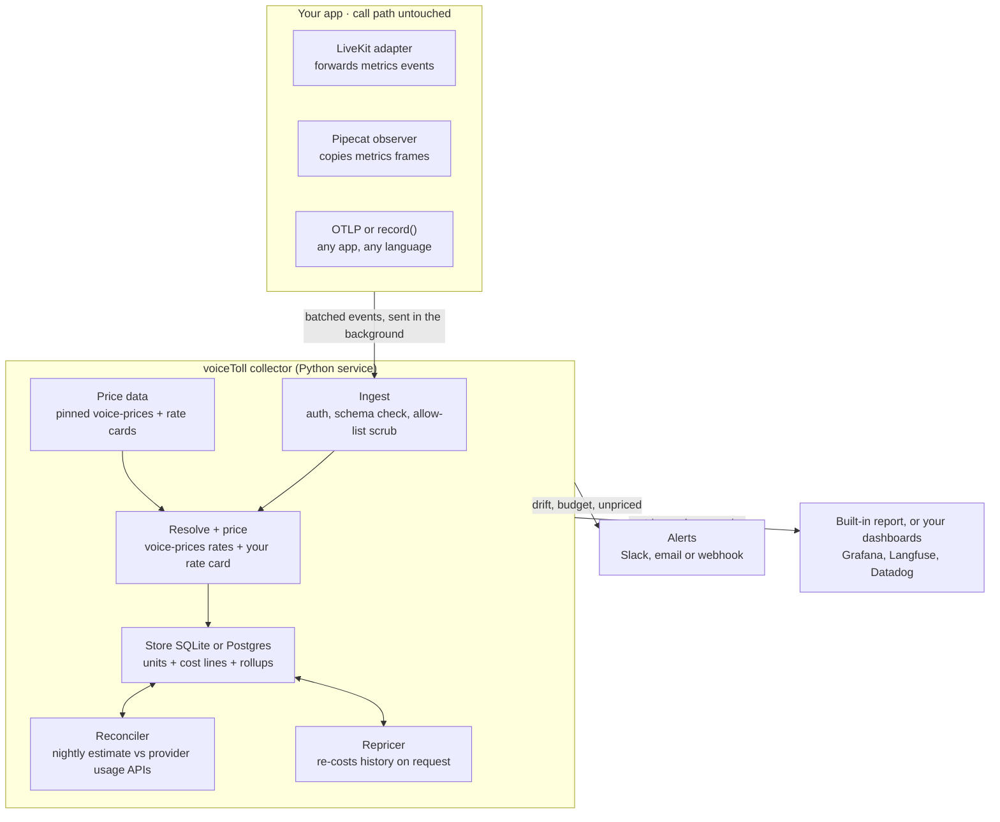
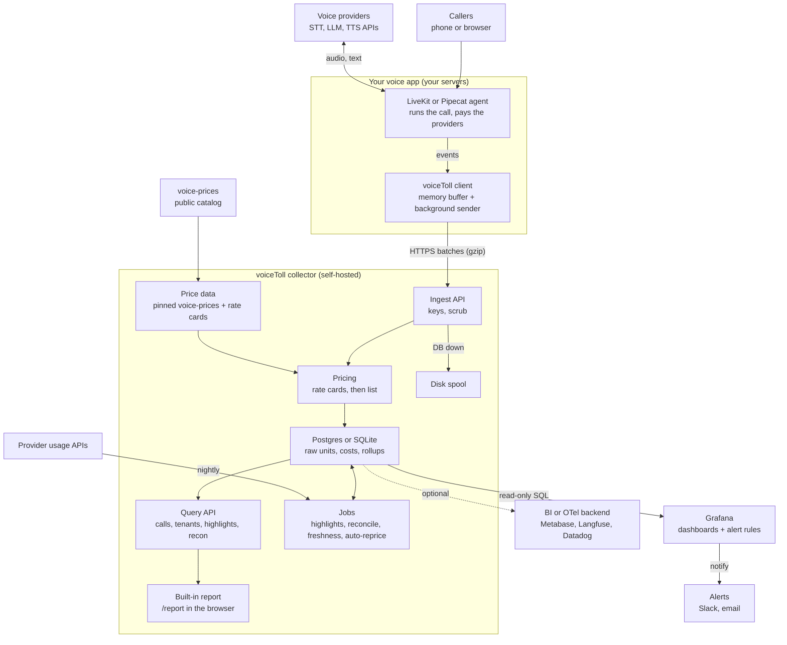
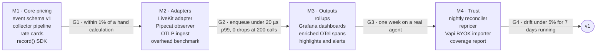

# voiceToll — Architecture (v1, collector-first)

Last updated 2026-09-29 · Neeraj Gera
Source of truth: this file (it lives with the code). The claude.ai doc is a synced copy for discussion and comments: https://claude.ai/code/artifact/7b78835a-78e0-4b17-a32a-7250bb422688

## Summary

voiceToll turns the usage and latency that voice frameworks already emit into per-call, per-tenant dollars, using current prices, without adding latency to the app. v1 is a separate Python **collector service** fed by thin in-app adapters; all pricing, storage and reconciliation happen outside the app.

**Goals (v1)**

- Cost and latency per turn, call, tenant and day for LiveKit Agents and Pipecat apps, plus any app that can send OpenTelemetry spans.
- Zero measurable latency added on the call path (adapter enqueue under 20 µs p99, benchmarked).
- Every dollar traceable to raw units, a price-data version and a rate-card version, so history can be re-priced.
- Daily check of estimated cost against provider usage data, with a drift alert.

**Non-goals (v1)**

- Capturing or storing any audio or text.
- Auto-patching HTTP or WebSocket clients inside apps.
- Billing end customers (it informs pricing; it is not an invoicing system).
- Building a full dashboard product. The collector ships two built-in pages: the per-project report (`/report`) for the day-to-day view, and an operator console (`/admin`) for prices, cost across projects and collector health ([08 Admin UI](08_ADMIN_UI.md)). Both are read-only; Grafana and existing OTel backends stay the place for alerting and long-range exploration.
- Maintaining the public price catalog (that is [voice-prices](https://github.com/mahimailabs/voice-prices); voiceToll layers private rate cards on top).
- Dedicated adapters for other frameworks such as TEN, Vision Agents or Bolna. Apps on them can send data through OTLP or `record()` in v1; an adapter follows when a real user needs one, as its own module under `voicetoll.frameworks` or a separate package registered through the `voicetoll.frameworks` entry point.
- Speech-to-speech beyond what LiveKit already reports: planned, parked ([10 Speech-to-speech](10_SPEECH_TO_SPEECH.md)).

## Status

What is built and what is next, per function: [13 Project status](13_STATUS.md). This document describes the design; items marked **Open** below are designed but not built.

The collector refreshes **rollup tables** on ingest (`call_rollup`, `tenant_day`, `user_day`, `feature_day`, `cost_day`) and still serves session, tenant and single-day breakdown API summaries from raw rows; the admin views read the rollups and fall back to raw rows only where a rollup cannot answer (see Data model). The background jobs loop runs reconciliation, then the price-freshness check, then highlights; a pricing check every minute reloads a changed rate-card file and re-costs recent history when prices change.

## System overview

Three layers: thin adapters inside the app, one collector service that does all the work, and the team's existing dashboards and alerting as the front end.



Events flow down; only the adapter row runs inside the app, and it never waits on anything below it. Framework field mapping happens **in the adapters** (stdlib client); the collector validates the allow-listed `CaptureEvent` and prices it. The Price data box is the only place rates live, which is what makes re-pricing and reconciliation possible.

## Complete architecture: built-in report and Grafana

The app pays providers and emits events; the collector prices and stores them. Two read-only windows sit on the result: the collector's built-in report page, which works on SQLite with nothing extra to install, and optionally Grafana over Postgres for alerting and long-range charts. Nothing in voiceToll depends on Grafana, so it can be swapped or left out.



**What the built-in report provides** (`http://<collector>/report`, shipped)

| View | What it shows |
| --- | --- |
| Day summary | Estimated cost, calls, call minutes, cost per minute, unpriced share, spooled batches (days are UTC) |
| Where the money went | Cost by provider, by stage (STT, LLM, TTS) and by model |
| Calls | Every call on the day, sortable by cost, minutes, turns or cost per minute; unpriced lines flagged |
| One call | Cost and usage per stage, cost per turn, latency p50/p95 per stage |
| Highlights | The last 7 days of findings from `GET /v1/highlights` |
| Estimate vs provider bill | Reconciliation runs for the last 14 days: estimate, provider figure, dollar and unit drift, status |

The page is static HTML with no data in it; it calls the Query API with the viewer's ingest key, which it keeps in that browser only (or with the admin key and `#project=` when opened from `/admin`). It uses the same Console Kit theme as the admin UI, dark or light, and prints on a light background, so print or save-as-PDF gives a shareable daily or G3 report. It has no alerting.

**What the admin UI provides** (`http://<collector>/admin`, shipped; needs `VOICETOLL_ADMIN_KEY`; details in [08 Admin UI](08_ADMIN_UI.md))

| View | What it shows | Reads from |
| --- | --- | --- |
| Prices | Every provider/model/meter that produced cost in the range, the price actually applied, source (rate card, voice-prices, not billed, unpriced), tags (stale, unverified, unpriced, drifting, expiring, before rate card, fell back to list), share of spend on stale rates, a rate-card snippet for each unpriced pair. An **All available** tab lists every model voiceToll can price (voice-prices catalog plus rate cards) with list prices, meters, freshness and what is in use | `cost_line`, rate cards, voice-prices catalog and freshness, `recon_run` |
| Reports | Today so far vs the same time yesterday per project; last 14–90 days with cost, calls, cost per minute, unpriced share, highlights and reconciliation status; each day opens `/report` for that project | `call_rollup`, `cost_day`, `highlight`, `recon_run` |
| Cost | Totals vs the previous period, daily cost stacked by stage, provider, model or agent version, cost by provider and model, top tenants, 14-day estimate-vs-bill strip; filters for provider, stage, model, feature, agent version, region, env and tenant | `call_rollup` and `cost_day`; raw rows for call counts under a dimension filter, and for breakdowns under a tenant filter |
| Health | Database, spool (including batch files set aside), background jobs, pricing check, config and client checks; events per minute and ingest latency; who is sending and receive lag; in-app client counters; reconciliation connectors (key present, never shown); recent collector warnings | Collector memory (per replica, reset on restart), `usage_event`, `client_stats`, `recon_run` |

**Admin UI design decisions**

| Decision | Choice | Why |
| --- | --- | --- |
| Where it lives | Static `admin.html` served by the collector at `GET /admin`, calling read-only JSON endpoints under `/v1/admin/*` | Same as `/report`: no build step, no second deployable, works on SQLite |
| Auth | `VOICETOLL_ADMIN_KEY`, header `X-Voicetoll-Admin-Key`, compared in constant time | Prices, health and spool are collector-wide; ingest keys keep their per-project scope |
| Unset admin key | `/admin` and `/v1/admin/*` return 404, except in open (dev) mode with no ingest keys | Nothing collector-wide is exposed by default in a shared deploy |
| Key storage in the browser | `sessionStorage` (the report uses `localStorage`) | The admin key is more powerful and should not outlive the tab |
| Writes | None | Rate cards are versioned YAML; the UI gives copyable snippets |
| Routing | View and filters in the URL hash; saved views in `localStorage` | Every screen is linkable |
| Data | Cost and Reports read `call_rollup` and `cost_day`, falling back to raw rows only for call counts under a dimension filter and breakdowns under a tenant filter; Health series are in memory per replica | Fast on 90 days across projects; fleet-wide health stays with Prometheus |
| Effective price | Cost ÷ quantity of current cost lines | Shows the price actually applied, rate card included |

Every view has filters that live in the page address (so a filtered screen is a link) and saved views per browser. The admin UI is off in a shared deploy until the key is set; in open (dev) mode it needs none.

**What Grafana provides** (optional)

| Job | What it shows or does | Reads from | Status |
| --- | --- | --- | --- |
| Cost dashboards | Daily cost, top tenants, costliest calls (with p95 TTFB), highlights list | Postgres (read-only SQL) | **Shipped** (4 panels in `deploy/grafana`) |
| Latency dashboards | p50/p95 per component (end-of-turn, STT, LLM time to first token, TTS time to first byte, voice-to-voice), slowest turns with their cost | Postgres | **Open** |
| Trust panels | Share of spend unpriced or on stale rates, reconciliation drift per provider | Postgres | **Open** |
| Collector health | Events ingested, rejected, dropped, spooled, across replicas and over weeks | Collector `/metrics`, scraped by Prometheus or Grafana Alloy | **Open** (no scraper in Compose yet; the admin Health view covers one replica since its last start) |
| Alerting | Rules on the same queries (drift over 5%, p95 over budget, spend spike, new unpriced model) sent to Slack or email | Postgres and metrics | **Open** |

**What it does not do:** no pricing, no storage of its own, no ingestion. `docker compose --profile observability up` opens the provisioned dashboard. Two cautions: the dashboard queries Postgres only (a SQLite dev collector shows nothing there; use the built-in report), and Compose runs Grafana with anonymous **Admin** access, which is for a local machine only and must be turned off before any shared deployment.

**Why built-in pages and Grafana:** Grafana is free, self-hosted, familiar to engineering teams and has alerting built in, but it needs Docker and Postgres before anyone sees a number, and it is awkward for voiceToll's own views (one call's turns, highlights, estimate vs bill, which prices are stale). The built-in report and admin UI cover those with no setup and work on SQLite; Grafana remains the choice for alerts and fleet-wide time series. Finance-facing margin views are still an open question (extend the report, or pair with Metabase).

## In-app adapters

Adapters copy numbers the framework already produced into a bounded buffer and ship them in the background; they never parse, price or do I/O on the call path.

| Adapter | Hooks into | Captures | App change |
| --- | --- | --- | --- |
| `voicetoll.frameworks.livekit` (also `voicetoll.livekit`) | `AgentSession` `metrics_collected` events (or LiveKit's OTel traces) | STT audio seconds, LLM tokens + TTFT, TTS characters + audio seconds + TTFB, end-of-utterance delay | `attach(session, tenant, call_id)` + one event handler |
| `voicetoll.frameworks.pipecat` (also `voicetoll.pipecat`) | An observer on the `PipelineWorker` (Pipecat 1.x; `PipelineTask` on 0.0.x) reading `MetricsFrame`s | TTFB, processing time, LLM tokens (input taken gross of the prompt cache), TTS characters; STT seconds from the STT service's usage metrics on Pipecat 1.x, else from PCM bytes streamed | Add the observer; enable `enable_metrics` and `enable_usage_metrics` |
| OTLP (collector ingest) | Any OTel SDK exporter pointed at the collector | Whatever the spans carry, mapped per source | Change the exporter endpoint |
| `voicetoll.record()` | Manual call in the app | Any `Usage` fields + timings | One call per provider call |

**Session context.** At call start the adapter registers tenant, call id and the provider and model per component (stt, llm, tts). Framework metric events carry the numbers but not always the model, so this registry is what makes them priceable. Three optional attributions ride along: an **end user** under the tenant (HMAC'd like the tenant); a **feature** tag, which the app can change mid-call when the conversation moves from, say, rescheduling to billing; and an **agent version** for comparing prompt or model changes. Tag keys are fixed and values are checked at ingest (at most 200 distinct values per key per project), so dashboards stay readable.

**Capture event (wire format sent to the collector)**

```json
{"event_id":"01J9…","source":"livekit","schema":1,"ts":"2026-09-27T14:02:11.482Z",
 "project":"clinicline","tenant":"h:7f3a…","user":"h:c21e…","session":"lk_room_8f2a","turn":4,
 "tags":{"feature":"reschedule_appointment","agent_version":"receptionist-v14","env":"prod","region":"us-east"},
 "component":"tts","provider":"elevenlabs","model":"eleven_flash_v2_5","voice_class":null,
 "units":{"characters":188,"audio_output_seconds":11.84},
 "src":{"characters":"estimated","audio_output_seconds":"estimated"},
 "how":{"characters":"len_chars","audio_output_seconds":"audio_duration"},
 "timing_ms":{"ttfb":183,"duration":942},"status":"ok","cancelled":false}
```

Units on the wire are flat floats; provenance rides in sibling `src` and `how` maps. At rest the store nests them as `{"characters":{"v":188,"src":"estimated","how":"len_chars"}}` in `units_json`. Timing keys on the wire have no `_ms` suffix (values are already milliseconds). See [07 Field allow-list](07_FIELD_ALLOWLIST.md) for the full published list.

**Latency and safety guarantees**

- Enqueue only: copy up to ~15 fields into a ring buffer; target under 20 µs p99 (G2). CI asserts a looser bound (~200 µs) so flaky machines do not fail the suite; the printed p50/p99 numbers are what gate G2.
- Background exporter thread batches every 1 s or 200 events, gzip over HTTP to `POST /v1/events` (OTLP/HTTP for the OTel path).
- Bounded memory: 10,000 events (about 5 MB). When full, drop and increment `voicetoll_dropped_total`; never block.
- Fail open: every exception in the adapter is caught and counted; the call proceeds untouched.
- Collector down: exponential backoff for up to 60 s of buffered data, then drop with a counter.
- Kill switch: `VOICETOLL_DISABLED=1` makes every adapter a no-op.
- Serverless runtimes: flush on shutdown hooks; no thread required in `record()` mode.

## Collector pipeline

Each accepted event is validated, priced and stored. Stages are pure functions of the event plus versioned reference data, so pricing can be re-run later (repricer).

| # | Stage | What it does | Status |
| --- | --- | --- | --- |
| 1 | Ingest | Per-project ingest key; schema version check; allow-list scrub drops unknown fields; dedupe on `event_id` | **Shipped** |
| 2 | Resolve + price | Matches provider + model with voice-prices; rate card first, then voice-prices; `unpriced` / `not_billed` when $0 would be wrong | **Shipped** |
| 3 | Store | Transaction for event + cost lines (SQLite or Postgres); on DB failure, append-only disk spool and ordered replay | **Shipped** |
| 4 | Aggregate | Upserts call / tenant-day / user-day / feature-day rollups | **Shipped** |
| 5 | Export | Prometheus counters at `/metrics`; Grafana dashboards provisioned | **Shipped** (enriched OTel export still optional) |
| 6 | Jobs | Reconciliation, price freshness and highlights run hourly; a one-minute pricing check reloads rate cards and reprices on a change | **Shipped** |

Framework → voice-prices unit renaming happens in the **client adapters**, not a collector normalize stage. OTLP ingest maps spans to the same `CaptureEvent` allow-list.

**Price precedence (highest first):** project rate card for that provider/model/meter and date → voice-prices snapshot in effect at the event timestamp → unpriced. Units a model does not bill → `not_billed` (amount 0 with an explicit source). A rate card entry can also be a multiplier (e.g. 0.8 × list price for a volume deal).

**Cost of one meter:** `amount = quantity × (unit price ÷ unit size) × voice multiplier`

For example, 188 TTS characters at $0.05 per 1,000 characters = $0.0094.

**Throughput target (v1):** 2,000 events/s on one 2-vCPU instance. At 3–4 events per turn, that covers roughly 500 concurrent calls. Scale out by running more collector replicas behind a load balancer; stages are stateless apart from the database.

## Latency

Every event carries its timings, and the collector turns them into latency percentiles per component and per turn, stored next to cost. v1 records what the frameworks already time; it adds no clocks of its own to the call path.

| Metric | What it measures | LiveKit source | Pipecat source |
| --- | --- | --- | --- |
| End-of-turn delay (ms) | User stops speaking → agent decides the turn is over | EOU metrics: `end_of_utterance_delay` | Turn and VAD frame timestamps |
| STT delay (ms) | End of speech → final transcript | EOU metrics: `transcription_delay` | STT TTFB and processing metrics |
| LLM time to first token (ms) | Request sent → first token back | LLM metrics: `ttft` | LLM TTFB metric |
| TTS time to first byte (ms) | Text sent → first audio byte back | TTS metrics: `ttfb` | TTS TTFB metric |
| TTS real-time factor | Synthesis time ÷ audio length | TTS `duration` ÷ `audio_duration` | Processing time ÷ audio seconds |
| Voice-to-voice (ms) | User stops speaking → first agent audio | Derived per turn from the three above | Derived per turn from frame timestamps |
| Interruptions | Agent speech cut off by the caller | TTS `cancelled` | Interruption frames |

Field names follow the frameworks' current docs; the M2 contract tests pin them per framework version.

**How numbers are aggregated**

- Raw timings stay on each `usage_event`, so any percentile can be recomputed later.
- `call_rollup` stores p50/p95 per call, computed from raw timings; the session API computes percentiles at query time from stored timing columns.
- Percentiles across days or tenants are recomputed from raw timings, not averaged. Mergeable sketches (t-digest) are deferred until raw recomputation gets too slow.
- Dimensions: provider and model, component, feature, tenant, agent version, region.

**Voice-to-voice per turn** (shipped, used by the highlights): end-of-turn delay + LLM time to first token + TTS time to first audio, paired in time order within each call (a turn-timing event opens a turn; the next LLM and TTS timings close it), so it does not depend on framework turn ids. Realtime models use end-of-turn delay + time to first token.

**Views that join latency and cost** (**Open**: planned Grafana latency panels)

- Cost against p95 latency per provider and model, to see the tradeoff of a switch before making it.
- Slowest turns of the day, each with its cost breakdown and the component that was slow.
- Latency budget alerts, e.g. p95 voice-to-voice above 1.2 s for 15 minutes.

**Caveats**

- Timings are taken inside the app's process, so they include the app's own event-loop delay; they are not pure network or model time. Open: where a provider returns server processing time (e.g. OpenAI's `openai-processing-ms` header), store it so model time can be split from network time; framework metrics don't expose it today.
- Streaming over one WebSocket can hide TTFB after the first request; Pipecat has an open issue about exactly this for Cartesia and ElevenLabs ([#3451](https://github.com/pipecat-ai/pipecat/issues/3451)). Open: flag the affected metrics as partial.
- Network time between the caller's phone or browser and the server is not visible to server-side code, so it is out of scope for v1.

## Highlights

The main output people read is a short, ranked list of findings, each with its dollar or user impact and a link to the calls behind it. Eight rule-based highlights are shipped.

| Highlight | Status | Flags when (default, configurable) | Typical action |
| --- | --- | --- | --- |
| Heavy tenants (`heavy_tenant`) | **Shipped** | Tenant cost well above the project median over the window; "unprofitable" needs revenue input (open question) | Pricing tier, fair-use cap |
| Long-session cost growth (`long_session`) | **Shipped** | Calls over the length threshold | Summarize or trim context |
| Wasted speech (`wasted_speech`) | **Shipped** | Cancelled TTS characters above the threshold share. Dollars at stake not yet computed (shows $0) | Smaller TTS chunks |
| Unpriced usage share (`unpriced_share`) | **Shipped** | Share of cost lines that are unpriced is elevated | Add a rate-card entry |
| Estimate drifts from a provider (`recon_drift`) | **Shipped** | Reconciliation drift above the threshold two or more days running on a dedicated account | Fix the rate card or mapping, then reprice |
| Change after a release (`release_change`) | **Shipped** | Cost per minute or p95 voice-to-voice of the newest agent version moves more than 15% against the previous version's 7 days before the release; at least 3 calls on each side (10 turns for latency). Dollars at stake = extra cost so far | Roll back or accept |
| Slowest component (`slow_component`) | **Shipped** | At least 20 turns, 10% or more of them over the voice-to-voice budget (1.2 s), and one stage (turn detection, LLM time to first token or TTS time to first audio) is the biggest part of at least half of those | Tune turn detection, or switch provider or model |
| Stale price (`stale_price`) | **Shipped** | A voice-prices rate used in the last 7 days is stale (older than the provider's threshold, usually 60 days) or was never verified by a person, and no rate-card entry covers it. Dollars at stake = the spend priced with it | Add a rate-card entry or update voice-prices |

Also shown when the data exists: feature hotspots (needs the feature tag), latency by region (needs the region tag), short or abandoned calls, and the share of spend that is unpriced, on stale rates or drifting from provider data.

**Region.** The adapter fills a `region` tag with the server's deployment region automatically, from an environment variable or the framework's host region. The caller's own region is not detectable server-side, and IP geolocation is out of bounds under the privacy rules, so apps may send an optional coarse `caller_country` tag themselves.

**How highlights are produced**

- Each highlight is a SQL query over rollups plus a threshold, refreshed by the background jobs loop; results are stored with the evidence (tenant, window, calls) so every item is explainable.
- Ranked by dollars at stake per week; items without a cost or user impact rank last.
- Noise guards: minimum samples (3 calls per agent version, 20 turns for latency rules; configurable) and a 7-day baseline for release changes are shipped. Open: re-fire only when a finding worsens, snooze and dismiss per item.
- Thresholds are set per project, since "heavy" differs between a $15/month app and an enterprise contract.

**Delivery:** shipped: `GET /v1/highlights`, the Highlights section of the built-in report, and a Highlights panel in the Grafana dashboard. Open: weekly digest by Slack or email. User-level items show pseudonymous ids only; mapping them back to people stays with the app.

**Later:** silence billed as STT (needs reliable speech-seconds from VAD), and an AI-written weekly summary built on top of these rule outputs.

**Framework modules.** The collector never sees framework objects, only the framework-neutral capture event, so it works the same whichever framework (if any) produced an event. Each adapter is one module under `voicetoll.frameworks` that owns its framework's naming convention (LiveKit plugin module paths, Pipecat `<Brand>[Http|WebSocket]<STT|LLM|TTS>Service` class names) and reduces it to a brand token; `voicetoll.providers` maps brand tokens and API hosts to voice-prices provider ids in one place (`azureopenai` → azure, `polly` → aws), so breakdowns and reconciliation see one spelling per provider. A new framework is a module or a separate package registered through the `voicetoll.frameworks` entry point, following the contract in `frameworks/base.py`. How other providers fare out of the box, and the plan to close the gaps: [09 Provider coverage](09_PROVIDER_COVERAGE.md).

**Client counters.** With each batch the client also sends a `client` object next to `events`: a random per-process id, SDK version, and cumulative counts of events dropped, adapter errors and events sent, plus buffer depth and size. Numbers and ids only, allow-listed at ingest (`ClientStats` in `schema.py`); bad values are ignored and never fail the batch. The collector keeps the latest per client (`client_stats`) for the admin Health view, which is how drops inside apps become visible.

## Data model

Raw units are immutable; dollars are derived rows that can be regenerated, so a price fix never touches what was measured.

Portable SQL only (SQLite and Postgres): no JSON operators; tag dimensions are real columns. Rate cards ship as YAML files today (`config/rate_cards.yaml`), not a DB table.

| Table | Grain | Key fields | Mutable? | Status |
| --- | --- | --- | --- | --- |
| `usage_event` | One provider call or meter event | `event_id`, `ts_epoch`, project, tenant (HMAC), user (HMAC), dimension columns, session, turn, component, provider, model, timing columns, `units_json`, status, cancelled | No, append only | **Shipped** |
| `cost_line` | One meter of one event, per price version | `event_id`, meter, quantity, `amount_usd`, `price_source` (`rate_card` \| `voice_prices` \| `not_billed` \| `unpriced`), versions, freshness, `is_current` | Superseded, never edited | **Shipped** |
| `call_rollup` | One call | session, tenant, minutes, cost by component, p50/p95 latencies, unpriced count | Recomputed | **Shipped** |
| `tenant_day` | Tenant × day | minutes, calls, cost, cost per minute | Recomputed | **Shipped** |
| `user_day` | Tenant × end user × day | minutes, calls, cost | Recomputed | **Shipped** |
| `feature_day` | Tenant × feature × day | minutes, turns, cost, p95 latency | Recomputed | **Shipped** |
| `recon_run` | Provider × day | estimated USD, provider-reported usage and USD, drift %, status | No | **Shipped** |
| `highlight` | One finding | rule id, project, window, evidence, dollars at stake, status | Updated | **Shipped** |
| `price_freshness` | Project × provider × model (last 7 days) | freshness status, last verified, age, spend on list price and on rate cards | Replaced each check | **Shipped** |
| `collector_state` | Key | price versions history was priced with, last automatic reprice, rate-card load error | Updated | **Shipped** |
| `cost_day` | Project × day × stage, provider, model, feature, agent version, region, env, source × price source | cost, cost lines, unpriced lines, events | Added to in the ingest transaction; rebuilt per day after repricing; `voicetoll-collector rebuild-rollups` and a one-time backfill on upgrade | **Shipped** |
| `client_stats` | Project × client process | SDK version, source, dropped, errors, sent, buffer depth and size, last report | Replaced on each batch | **Shipped** |

**How the admin views use the rollups.** Call counts, minutes and cost per call come from `call_rollup`; daily stacks, breakdowns and unpriced share come from `cost_day`. Two combinations fall back to raw rows because a rollup cannot answer them: call counts under a provider/model/feature filter (a call spans several providers), and breakdowns under a tenant filter (`cost_day` has no tenant column, which keeps it small). The response says which source it used (`read_from`).

```sql
-- As shipped (portable SQL; SQLite and Postgres)
create table usage_event (
  event_id    text primary key,
  project_id  text not null,
  source      text,
  ts_epoch    double precision not null,
  day         text not null,           -- YYYY-MM-DD UTC
  received_epoch double precision,
  tenant_id   text,                    -- HMAC, never raw
  user_id     text,                    -- optional end user, HMAC
  session_id  text not null,
  turn        int,
  component   text not null,           -- stt | llm | tts | s2s | vad | telephony | platform | turn
  provider    text,
  model       text,
  voice_class text,
  feature     text,                    -- from tags, real columns (not JSONB)
  agent_version text,
  env         text,
  region      text,
  caller_country text,
  status      text,
  cancelled   integer not null default 0,
  request_id  text,
  ttfb_ms     double precision,
  ttft_ms     double precision,
  duration_ms double precision,
  eou_delay_ms double precision,
  transcription_delay_ms double precision,
  processing_ms double precision,
  units_json  text not null            -- {"characters":{"v":188,"src":"estimated","how":"len_chars"}}
);

create table cost_line (
  event_id          text not null,
  meter             text not null,
  quantity          numeric not null,
  unit_src          text,
  unit_how          text,
  amount_usd        numeric not null,
  price_source      text not null,     -- rate_card | voice_prices | not_billed | unpriced
  price_version     text not null,
  rate_card_version text not null default '',
  freshness         text,
  unpriced_reason   text,
  is_current        integer not null default 1,
  created_epoch     double precision,
  primary key (event_id, meter, price_version, rate_card_version)
);
```

Storage: about 400 bytes per event plus about 150 per cost line. One million calls a month at 30 events each is roughly 16 GB a month before compression, which is where a later move to ClickHouse would pay off. Retention default: raw events 13 months, rollups indefinitely.

## Flows

Five flows cover v1: the live call, event to dollars, nightly reconciliation, repricing, and price-data freshness. Only the first touches the app, and only for the enqueue.

**1–2. Live call and event to dollars**

```mermaid
sequenceDiagram
  participant F as Framework (call path)
  participant A as Adapter (in the app)
  participant E as Exporter (background thread)
  participant C as Collector (separate service)
  participant O as Store and summaries
  F->>A: metrics event
  A-->>F: returns in under 20 µs
  A->>E: background drain
  E->>C: POST batch every 1 s
  C->>C: ingest and price
  C->>O: event + cost lines
  Note over F,O: About 1–3 s from the metrics event to dollars on a dashboard; the call never waits on any of it.
```

The dashed return is the only step the call waits for. Everything after it happens on another thread or another machine.

**3. Nightly reconciliation (per provider account, per day) — shipped; to be verified with live keys**

1. Accounts are configured in `config/reconcile.yaml` (`VOICETOLL_RECON_CONFIG`): one entry per provider account or provider-side project, mapped to one voiceToll project, with scope `dedicated` or `shared` and the name of the environment variable that holds its key. Keys never go in the file.
2. Pull yesterday's usage for each account: OpenAI Costs API (dollars, filtered to an OpenAI project), ElevenLabs character stats (characters), Deepgram project usage (audio seconds; dollars too when the API returns them).
3. Compare with voiceToll's estimated dollars and measured units for the same project, provider and day. Write one `recon_run` row per account and day (a re-run overwrites it) with dollar drift and per-unit drift.
4. Status `drift` when any measured drift exceeds the threshold (default 5%) on a dedicated account, or `drift_shared_account` on a shared one, which never alerts. Two or more days of drift in a row set an alert and raise the `recon_drift` highlight.
5. Contract tests replay each connector against its provider's documented response shape (`tests/fixtures/provider_usage/docs`). After the first real day, `voicetoll-collector recon-capture` saves the real responses with identifiers redacted (`.../live`); once the numbers are checked against the dashboards, the tests pin them. Details the docs leave open are handled defensively: ElevenLabs is asked for `tts_characters` explicitly (not credits), Deepgram is asked for one day and rows for other days are ignored, and OpenAI results are grouped by project and paged.
6. **Setup check — shipped.** `voicetoll-collector doctor` tests each key the way reconciliation uses it, finds the provider-side project and names missing permissions; `--write` saves `config/reconcile.yaml`. With no reconciliation key set, Deepgram and ElevenLabs fall back to the agent's key (OpenAI needs an admin key). User guide: [12 Getting started](12_ONBOARDING.md).
7. **Per-call audit — shipped.** Daily totals blur a test call into everything else that day, so `voicetoll-collector audit-call <call-id>` (also `GET /v1/audit/{call}` and the **Audit** button on each call in `/report`) narrows the comparison to one call: the window runs from 2 minutes before its first event to 1 minute after its last, and each provider's per-request log is read for that window (ElevenLabs `/v1/history`, Deepgram `/projects/{id}/requests`, OpenAI usage in 1-minute buckets). It uses the same accounts and keys, stores nothing, and never returns provider text (ElevenLabs history text is measured and dropped). ElevenLabs shows both the text length and how far the account's quota moved, which tells characters and credits apart. `examples/test_agent/known_input_test.py` sends each provider an input of known size (30.0 s of audio, 500 characters, one fixed prompt) so the audit can be checked against numbers fixed in advance.
8. Open: show the latest drift next to cost figures in the report's call views; a "waiting for provider data" status while a provider reports fewer requests than voiceToll saw, with the last 3 days re-checked automatically and alerts only once data has settled; a "Connect providers" page in the admin UI running the `doctor` checks; provider request ids on every event (Pipecat does not send them yet) so the call audit can look requests up by id.

**Why accounts, not projects:** a provider usage API reports a whole account or provider-side project, including traffic that never passed through voiceToll (for example non-voice LLM calls on the same OpenAI organization). Reconciliation is only meaningful for an account that carries just the voice traffic, which is why each account declares its scope and is compared once.

**4. Repricing — shipped, automatic on price changes**

1. Trigger: every minute the collector checks the rate-card file and the voice-prices version. A changed rate-card file is reloaded (new events use it at once); an invalid file is ignored with an error in the log and the report, and the previous rates stay in force.
2. When the rate-card version or the voice-prices version differs from the one history was priced with, events from the last 45 days (`VOICETOLL_AUTO_REPRICE_DAYS`; 0 turns this off) are priced again. `voicetoll-collector reprice` still re-costs any range by hand.
3. Only events whose cost lines come out different get new `cost_line` rows; the old ones are marked `is_current = false` and stay queryable for audit. Nothing measured is changed.
4. Affected call, tenant, user and feature rollups are recomputed; the run (reason, events changed, dollar change) is recorded and shown in the report's Price data section.

**5. Price-data freshness — shipped (hourly, and at start-up)**

1. For every provider and model that carried cost in the last 7 days, compute today's voice-prices freshness (verified, stale, imported, seed) from its last human check and the provider's staleness threshold. Spend on a rate-card entry is shown separately: your own rate does not age with the catalog.
2. Results go to `price_freshness`, `GET /v1/prices`, `voicetoll-collector prices` and the report; a rate used by live traffic that is stale or unverified raises a `stale_price` highlight.
3. Open: a review step for catalog price changes (accept the new rate, or keep the old one with a rate-card entry). Today a voice-prices upgrade reprices automatically.
4. Reconciliation is the backstop: where a provider's usage API reports dollars, a price change nobody has catalogued shows up as dollar drift.

## Privacy, security and failure modes

The rule is metadata by allow-list, pseudonymized, never content; a failure anywhere in voiceToll costs a record, never a call.

**Privacy and security**

- Allow-list enforced in the adapter and again at ingest: only schema fields leave the app; no text, audio, raw URLs, headers or provider error messages. Full list: [07 Field allow-list](07_FIELD_ALLOWLIST.md).
- Tenant and user ids are HMAC'd with a per-project key the app holds; the collector never sees raw ids.
- Provider API keys never reach voiceToll; reconciliation uses separate read-only usage or admin keys stored in the collector's secret store.
- Ingest keys per project, TLS in transit, row-level scoping by `project_id`.
- Self-hosted by default (Docker Compose), so data stays in the team's own infrastructure.

**Failure modes**

| Failure | Effect | Handling |
| --- | --- | --- |
| Adapter buffer full | Events dropped | Drop counter on the client, reported to the collector with each batch and shown per client in the admin Health view (a Clients check turns degraded) |
| Events lost between client and collector | Calls under-counted with no client drop | Each client reports how many events it saw acknowledged (`sent`); the collector counts what arrived from the same process (`client_stats.received`). Health shows Sent next to Arrived and the Clients check degrades when Sent is higher |
| Collector unreachable | Events buffered, then dropped | Backoff up to 60 s of data; drop counter; call unaffected |
| Unknown model or unit | $0 would be wrong | Stored as `unpriced` with a reason; `unpriced_share` highlight and the admin Prices view (alert on first sighting open) |
| Usage the price catalog rejects (e.g. audio tokens larger than the total) | Could have failed the batch | Pricing never raises: the event is stored with `unpriced` / `invalid_usage` (or `price_error`), the rest of the batch prices normally |
| Stale price data | Silent drift | Freshness recorded on every cost line; hourly freshness job with a `stale_price` highlight for rates in use |
| Estimate differs from bill | Loss of trust | Nightly reconciliation per provider account in dollars or units, two-day drift alert and highlight; drift next to cost figures is open |
| Duplicate or late events | Double counting or gaps | Idempotent on `event_id`; rollups recompute on arrival |
| Database down | Collector backs up | Accepted batches go to an append-only spool on the collector's disk (JSONL segments, 1 GB cap by default) and are replayed in order when the DB returns; replays are safe because writes are idempotent on `event_id`. Only storage errors spool a batch. Events that no longer validate are dropped from a replayed batch, and a file that fails three replays while the database is reachable moves to `spool/rejected/` so it cannot hold back the files behind it (shown in the admin Health view). When the spool is full, the collector returns 503 so adapters hold and retry |
| Framework changes its metric names | Mapper breaks | Versioned mappers with contract tests against pinned framework versions |

## Tech stack, deployment and v1 scope

Plain Python end to end, one `docker compose up` to self-host, and four milestones that each end on a measurable gate.

| Piece | Choice | Why |
| --- | --- | --- |
| Language and tooling | Python 3.11+, uv, Ruff, pytest | Same as voice-prices and the frameworks; one language to maintain |
| Collector schemas | Pydantic v2 in the collector only | Allow-list validation at ingest; client stays stdlib-only and builds plain dicts |
| Collector API | Starlette + uvicorn; OTLP/HTTP via `opentelemetry-proto` | Native batches and OTLP without FastAPI weight |
| Pricing | `voice-prices`, pinned version | Maintained catalog; rate cards (YAML) layer on top |
| Store | SQLite by default; Postgres 16 optional (`[postgres]` extra) | Local and CI without Docker; Postgres for shared deploys |
| Jobs | Background tasks inside the collector (reconcile, freshness, highlights hourly; pricing check every minute with automatic repricing) | No extra service for v1 |
| Outputs | Built-in report page (`/report`) and admin UI (`/admin`), static HTML over the Query API in the Console Kit theme, hand-rolled `/metrics`, provisioned Grafana dashboard (Postgres only), optional OTLP export (open) | Something to look at with zero setup; existing tools for alerting |

**Packages (two):** `voicetoll` (stdlib client: buffer, exporter, `record()`, framework adapters under `voicetoll.frameworks` with LiveKit and Pipecat as optional extras) · `voicetoll-collector` (ingest, pricing, storage, spool, summaries). The app never installs the collector's dependencies.

**Deployment:** Docker Compose with collector and Postgres; Grafana under the `observability` profile; a Helm chart after v1.



M1 ships first because pricing correctness is the product; adapters without trustworthy dollars are just another metrics exporter.

## Decisions and open questions

Eleven decisions are settled; four questions remain for G3 / publish.

| Decision | Reason |
| --- | --- |
| Collector service first, embedded mode later | No pricing work or data downloads inside apps; language-neutral |
| Consume framework metrics and OTel, don't patch HTTP clients | Frameworks already measure; avoids security-review friction and SDK churn |
| Store raw units; derive dollars | Re-pricing and invoice disputes without re-running anything |
| Metadata by allow-list, pseudonymized, never content | Passes security review; metadata can leak through errors, URLs and ids |
| voice-prices as the public catalog, private rate cards on top | Reuse maintained, dated prices; fix plan and negotiated-rate gaps locally |
| Reconciliation is part of v1, not a later add-on | Trust in the numbers is what the product sells |
| Cost events are always sent at 100%; only detailed traces may be sampled | Sampling undercounts spend and can show small tenants at $0; cost events are about 500 bytes each |
| Two packages; Starlette; SQLite-first portable SQL | Keeps the client stdlib-only; local/CI without Postgres; same queries on both dialects |
| Built-in report page for the day-to-day view; Grafana optional | Works on SQLite with no setup, fits voiceToll's per-call and reconciliation views, and prints as a shareable report; Grafana keeps alerting and long-range charts |
| Read-only admin UI in the collector, behind a separate admin key | Prices, cost across projects and collector health are collector-wide, so they need a key wider than a project's ingest key; same static-page pattern as the report, no second deployable |
| Framework adapters are modules behind a registry; provider names normalized in one shared place | The collector stays framework-neutral; a new framework is a module or package, and every framework spells a provider the same way for pricing and reconciliation |

**Open questions**

- [ ] First design partner: which real LiveKit or Pipecat app runs the G3 week?
- [x] Cost sampling: require 100% of voice events for cost; only detailed traces may be sampled (decided).
- [ ] Revenue input for margin: a per-tenant price table in the collector, or left to the team's BI? (Needed for the "unprofitable" highlight.)
- [ ] Contribute voice usage extractors upstream to voice-prices, or keep mappers in voiceToll? Also open: finance-facing margin and pricing views, by extending the built-in report or pairing it with Metabase?
- [ ] Name clearance: confirm "voiceToll" is free on PyPI, GitHub and the USPTO trademark search before publishing (renamed from voicemeter, which was too close to VB-Audio's Voicemeeter). Licence is MIT.
