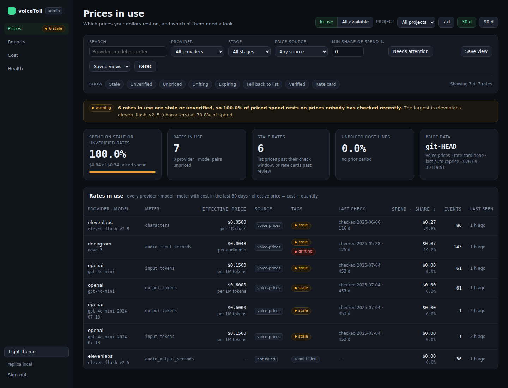
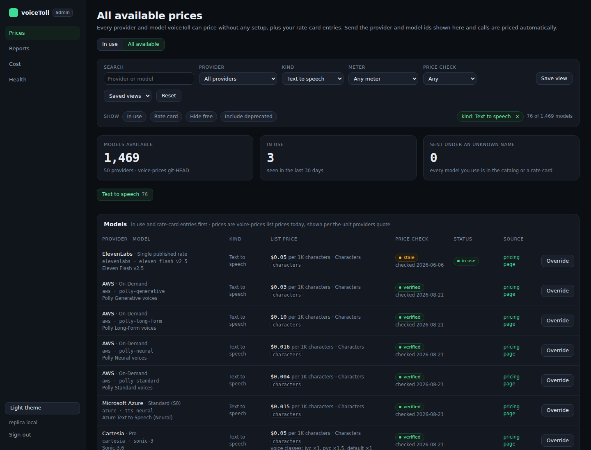
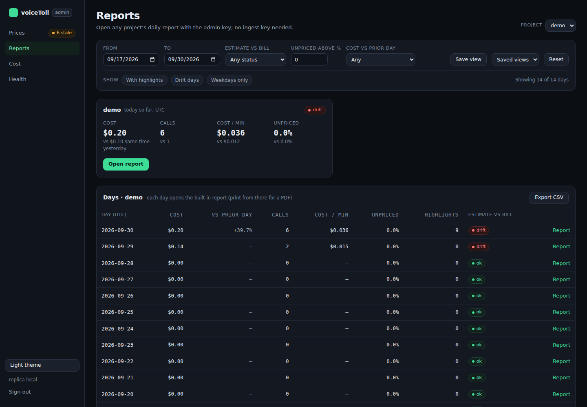
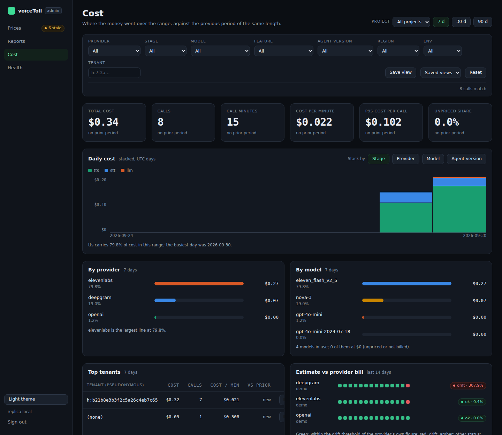
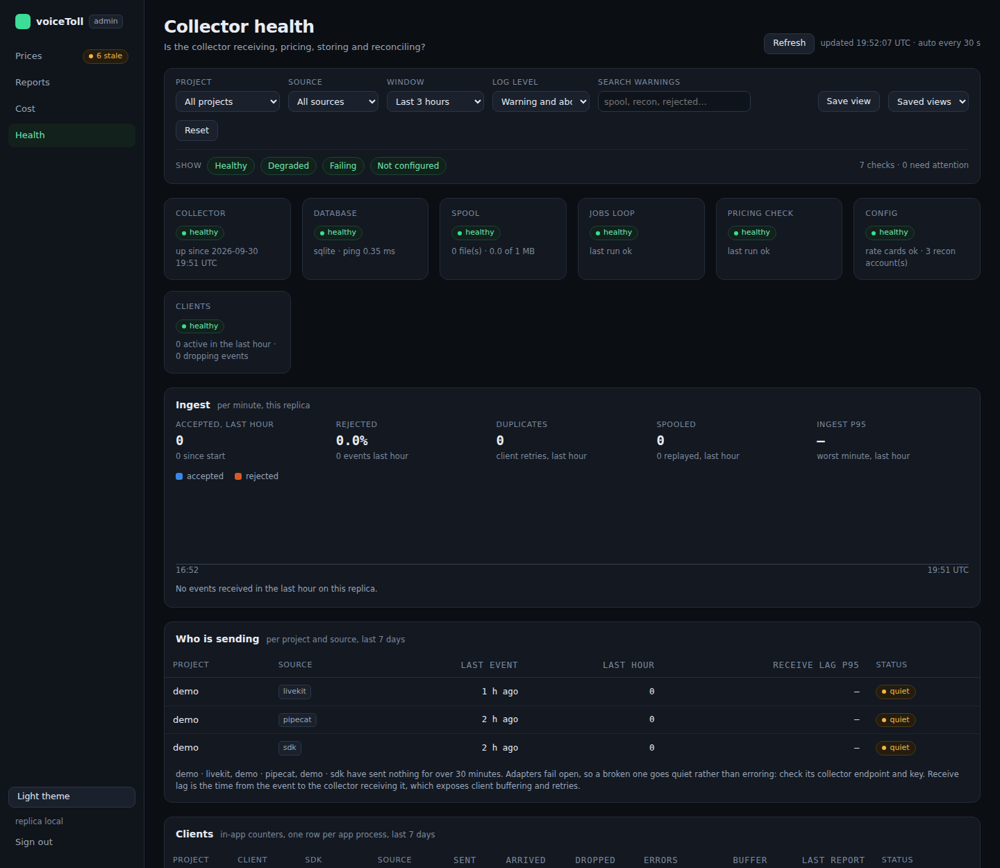

# voiceToll — Admin UI

The admin UI is voiceToll's control room. It shows which prices your costs are based on, what every project spent, and whether the collector is healthy. It covers all your projects in one place, and it's read-only: nothing you do here changes your data or your prices.

For a single day or a single call, use the report at `/report` instead. The admin UI links to it.

## Opening it

1. Choose an admin key: any long random string. Put it in `.env`:

   ```
   VOICETOLL_ADMIN_KEY=your-long-random-string
   ```

2. Restart the collector.
3. Open http://localhost:4319/admin (or your collector's address followed by `/admin`) and enter the key.

The key is kept only for as long as the browser tab is open. Use **Sign out** at the bottom of the menu to forget it sooner. If you see "The admin UI is off on this collector", the key isn't set yet.

Keep the admin key private: it can see every project, unlike the ingest keys your agents use.

## Finding your way around

The menu on the left (along the top on a phone) has four pages: **Prices**, **Reports**, **Cost** and **Health**. A small badge next to a page name flags something that needs a look, for example "4 stale" next to Prices.

Most pages have a **project** picker and a **7 d / 30 d / 90 d** range at the top right. Under that is a filter bar:

- Pick values from the lists, or type in the search box.
- The buttons under **Show** narrow the list further. Press one again to turn it off.
- Each filter you apply appears as a chip on the right. Press its × to remove it, or **Reset** to clear them all.
- **Save view** stores the current filters under a name, in this browser. Pick it later from **Saved views**.

The page address includes your filters, so you can bookmark a filtered page or send the link to a colleague (they'll need the admin key too).

**Light theme / Dark theme** at the bottom of the menu switches the colours. The report follows the same choice.

## Prices

Prices has two tabs.

### In use



This lists every price behind your costs in the chosen range: one row per provider, model and what's being charged (characters, audio seconds, input tokens and so on). Each row shows:

- the price actually applied, in the unit providers quote (per 1K characters, per minute of audio, per 1M tokens);
- where it came from: **voice-prices** (the published list price), **rate card** (your own rate), **not billed** or **unpriced**;
- when the price was last checked, how much you spent at that price, and when it was last used.

Tags point out prices that need attention:

| Tag | Meaning |
| --- | --- |
| stale | Nobody has confirmed this list price recently, or your own rate hasn't been reviewed in 90 days |
| unverified | This list price was imported and never confirmed by a person |
| unpriced | voiceToll doesn't know this model's price, so these calls are stored at $0 and marked as unpriced (never counted as free) |
| drifting | The provider's own figures differ from voiceToll's by more than 5% |
| expiring | Your rate for this model ends within 14 days |
| fell back to list | You have a rate for this model, but it didn't apply on that date, so the list price was used |
| rate card | Your own rate is used instead of the list price |

**Needs attention** shows only the rows that need a look. The tiles at the top show how much of your spend rests on prices nobody has checked recently.

If anything is unpriced, a panel below the table lists it. Press **Snippet** to get a rate card entry you can fill in and paste into your rate card file (`config/rate_cards.yaml` by default). The collector picks the change up within a minute and re-prices recent calls.

### All available



This lists every provider and model voiceToll can price out of the box (about 1,500 models from 50 providers), plus anything in your rate cards. Use it to compare options before you pick a provider, or to find the exact names to send.

For each model you see the provider and model names to use, its list prices, when those were last checked, and a link to the provider's pricing page. Models you already use, and models with your own rate, are listed first.

- Filter by provider, kind (LLM, speech to text, text to speech, speech to speech, agent platform, telephony), what's charged, or how recently the price was checked.
- Press a kind button (for example **Text to speech 76**) to see only that kind.
- Press **Override** next to a model to get a rate card entry pre-filled with its list price. You only need this if you pay a different rate, for example under a contract.
- **Models you send that have no price** lists names your calls use that match nothing. Those calls are unpriced until you use a listed name or add a rate card entry.

## Reports

Reports opens the daily report of any project, without needing that project's ingest key.



- A card per project shows today's cost, calls, minutes, unpriced share and bill-check status, with **Open report**.
- The table below lists each day for the chosen project: cost and change from the day before, calls, cost per minute, unpriced share, highlights and bill-check status. Each day links to its report.
- Filter by dates, bill-check status, unpriced share or cost change. The toggles show only days with highlights, days where the bill check found a gap, or weekdays.
- **Export CSV** downloads the days shown, for a spreadsheet.

## Cost

Cost shows where the money went over the chosen range, compared with the previous period of the same length.



- **Tiles:** total cost, calls, call minutes, cost per minute, cost of the most expensive calls (p95), and unpriced share.
- **Daily cost:** a bar per day, split by stage (speech to text, LLM, text to speech and so on). Switch the split to provider, model or agent version. Splitting by agent version shows whether a new release changed your costs.
- **By provider** and **By model:** your biggest costs for the range.
- **Top tenants:** your most expensive customers, with calls, cost per minute and change from the previous period.
- **Estimate vs provider bill:** for each provider you've connected, whether voiceToll's figures matched the provider's over the last 14 days.

Filter by provider, stage, model, feature, agent version, region, environment or tenant.

## Health

Health answers one question: is voiceToll receiving, pricing, storing and checking your calls? The page refreshes itself every 30 seconds; **Refresh** updates it straight away.



- **Checks** at the top: database, spool (calls held on disk while the database is unreachable), background jobs, price checks, configuration and your apps. Each shows healthy, degraded, failing or not configured, with a short note.
- **Ingest:** calls received per minute and how long the collector takes to accept them.
- **Who is sending:** each project and framework, when it last sent anything, and how late events arrive. A project that suddenly goes quiet usually means an agent has stopped reporting.
- **Clients:** each running copy of your app, with how many events it sent, how many arrived, and any it had to drop. Sent and Arrived should match; dropped events mean some calls are under-counted.
- **Reconciliation connectors:** each provider you've connected for bill checks, whether a key is set (the key itself is never shown), and the latest result. "agent key" means voiceToll is reusing your agent's own key.
- **Recent warnings:** the collector's latest warnings.

Filter by project, framework, time window or warning level, or search the warnings.

The numbers on this page are kept in memory: they start again when the collector restarts, and if you run several copies of the collector, each shows only its own.

The screenshots on this page come from a test setup with one project, `demo`.

## Related

- [12 Getting started](12_ONBOARDING.md): setting up voiceToll and connecting providers.
- [11 Verification](11_VERIFICATION.md): checking a single call against the providers.
